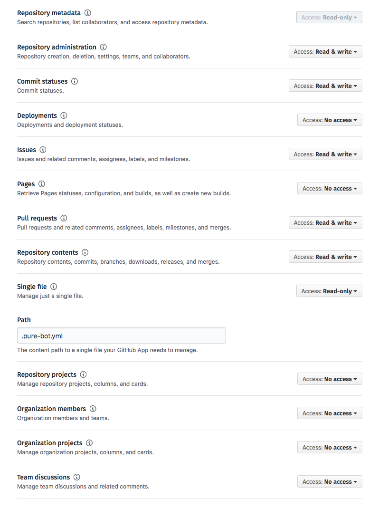
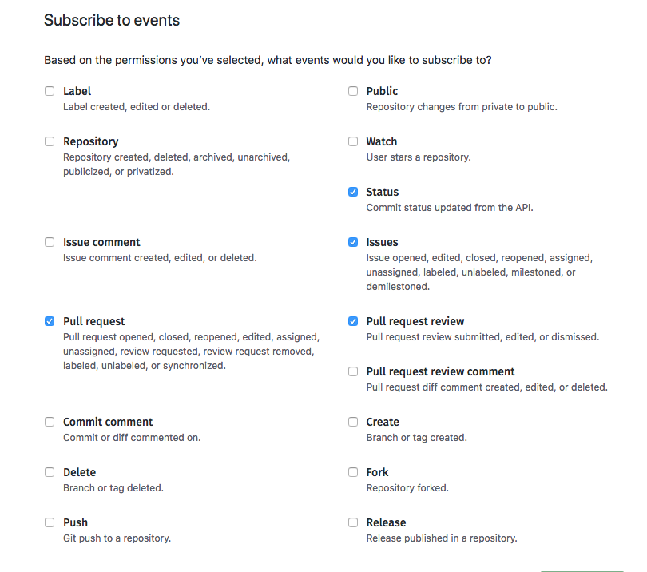
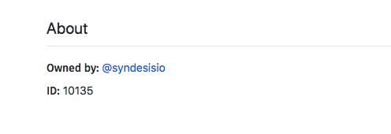

# PuRe Bot
[](https://circleci.com/gh/syndesisio/pure-bot)
[](https://raw.githubusercontent.com/syndesisio/pure-bot/master/LICENSE)
[](https://hub.docker.com/r/rhipaas/pure-bot/)

**Pu**ll **Re**quest Bot enables automated pull request workflows, reacting to input from webhooks and
performing actions as configured.

Currently actions include:

* Labeling with `approved` label on pull request review approval.
* Automerging a PR once it has `approved` label and passes all required status checks.
* Possible to label an new issue with a configurable label

## Running

```
$ pure-bot help run

Runs pure-bot.

Usage:
  pure-bot run [flags]

Flags:
      --bind-address string             Address to bind to
      --bind-port int                   Port to bind to (default 8080)
      --github-app-id int               GitHub App ID
      --github-app-private-key string   GitHub app private key file
  -h, --help                            help for run
      --tls-cert string                 TLS cert file
      --tls-key string                  TLS key file
      --webhook-secret string           Secret to validate incoming webhooks

Global Flags:
      --config string     config file (default is $HOME/.pure-bot.yaml)
      --debug             switch on debugging
```

## Building

```
$ make
building: bin/amd64/pure-bot

$ make image
building: bin/amd64/pure-bot
Sending build context to Docker daemon 73.18 MB
Step 1/6 : FROM alpine:3.5
---> 88e169ea8f46
Step 2/6 : MAINTAINER Jimmi Dyson <jimmidyson@gmail.com>
---> Using cache
---> 3cd3ad11bf98
Step 3/6 : RUN apk update && apk upgrade && apk add ca-certificates && rm -rf /var/cache/apk
---> Using cache
---> ae9fde8c1cc7
Step 4/6 : ADD bin/amd64/pure-bot /pure-bot
---> 29cbebdf88fd
Removing intermediate container abec733e4481
Step 5/6 : USER 10000
---> Running in c61f53a8a9fe
---> 78549c7310e4
Removing intermediate container c61f53a8a9fe
Step 6/6 : ENTRYPOINT /pure-bot
---> Running in dcc313c83466
---> 9090fd17e37e
Removing intermediate container dcc313c83466
Successfully built 9090fd17e37e
image: syndesis/pure-bot:3109e57-dirty

# Build and push a syndesis/pure-bot:testing which can be referenced in a dedicated test environment
$ make test-image
```


## Installation

`pure-bot` can be installed anywhere, probably best by running its Docker image and exposing the HTTP port to the outside.
This port must be reachable by GitHub for delivering WebHook events.
For an easy setup on OpenShift refer to the next section.

### OpenShift usage

In the directory `openshift/` you find a template `pure-bot-template.yml` which you can use to install pure-bot on OpenShift.

Use it like this, assuming you are connected to an OpenShift cluster:

```
# Create a new project for pure-bot
oc new-project pure-bot

# Install template
oc create -f openshift/pure-bot-template.yml

# Store the private key from your GitHub setup (see below) in a variable
priv_key=$(cat /path/to/private_key.pem)

# Instantiate the template
oc new-app pure-bot \
    -p ROUTE_HOSTNAME=pure-bot.my.openshift-cluster.com \
    -p APP_ID="1234" \
    -p WEBHOOK_SECRET=2d04842806f405ceba5e..." \
    -p PRIVATE_KEY="$priv_key" \
    -p VERSION="latest"
```

The `ROUTE_HOSTNAME` must be the hostname how your application in your project can be reached.
This differs from cluster to cluster, but should be easy to find.
You can check your OpenShift console for this information, too.

For how to get the values of the remaining parameter, see the next section.

### GitHub setup

`pure-bot` runs as an [GitHub App](https://developer.github.com/apps/building-github-apps/).
Please refer to the official documentation, how to install a GitHub App into an GitHub organization/user and activate it either for the whole organization or only for dedicated projects.

In short, you need to perform the following steps

* Go to the "Settings" of your GitHub organization or GitHub user.
* Select via menu items "Developer settings" --> "GitHub Apps"
* Push "New GitHub App"
* Fill out the form:
  - For the WebHook URL you need to provide the public URL how your agent can be reached. This is based on the `ROUTE_HOSTNAME` parameter given when instantiating the template
  - Enter a random Webhook secret which you should use as `WEBHOOK_SECRET` parameter when instantiating the template.
  - For the permissions select the following options: 
  - For the events select: 
* After you created the App, you should note the Appid and use it as `APP_ID` for the template: 
* Generate a private Key and and download it. The content of this file is used as `PRIVATE_KEY` parameter in the OpenShift template instantiation: 
* Finally you can install the GitHub App to an organization by choosing "Install". Here you can choose to install it for all repositories of this organization or only for selected repos.

### Config file

`pure-bot` use the following config file to setup authentication and other things.
For OpenShift this is installed as a ConfigMap `pure-bot-config` and filled with the parameters given during instantiation time.

The format looks like:

```yaml
webhook:

  # The secrtet configured in the GitHub App setup
  secret: c0434f32dca456d580917fac08912cd78c53cf07

github:

  # The GitHub App ID
  appId: 1234

  # Path to the private key downloaded from the setup
  privateKey: /secrets/private-key

# Default configuration for all repos
defaults:

  # Label related configuration
  labels:

    # Label applied when a review is approved.
    # If this label is given this switches on also the feature
    # of automerging when a review is aproved
    approved: "approved"

    # List of labels which can be used to mark a PR as 'work in progress'
    # In this case no automerging will be performed and a status check
    # will be set to pending. If this list is not configured, then
    # this feature is switched off
    wip:
    - "status/wip"
    - "wip"
    - "do not merge"

    # Label added when a reviewer is explicitely requested. In this case
    # also a status check "pure-bot/review-requested" is added which
    # will block until a first review is provided. If no such configuration
    # is given, this feature is switched # off
    reviewRequested: "status/review-requested"

    # List of labels to add when a new issue (not PR) is created.
    newIssues:
    - "triage"

  # List of patterns which when given in the title of a PR will prevent
  # automerging and a pure-bot/wip check will fail. Same semantics `labels: wip`
  # and can be used in addition. If no list is provide no check on the PR
  # title is performed.
  wipPatterns:
  - "do not merge"
  - "wip"

# Repos specific configuration overriding the defaults explained above
repos:

  # Repo name is the key of this map
  syndesis:

    # Overriding defaults. Until know there is not yet a way to _remove_ a config
    # here.
    labels:
      reviewRequested: "status/review-requested"
      approved: "status/approved"
      newIssues:
      - "notif/triage"

  pure-bot-sandbox:

    # You can disable pure-bot alltogether for certain repositories, which might be useful
    # if you enable pure-bot for a whole organization to be used by new repos
    # by default
    disabled: true
    board:
      zenhub_token: "<TOKEN>"
      github_repo: "<REPO>"
      columns:
        - name: "Inbox"
          id: "<ID>"
          isInbox: true
          events:
            - "issues_demilestoned"
            - "issues_opened"
        - name: "Backlog"
          id: "<ID>"
          events:
            - "issues_reopened"
            - "issues_milestoned"
        - name: "Review"
          id: "<ID>"
          events:
            - "pull_request_opened"
            - "pull_request_reopened"
        - name: "Done"
          id: "<ID>"
          postMergePipeline: true
```

As explained above, certain features are switched on only if the corresponding configuration is given.

### Board Config (Zenhub)

The board subsections in the config file define how issues will be moved on a zenhub board.
Each named column, backed by a [Zenhub column ID](https://github.com/ZenHubIO/API), is mapped to github events.
When this event are triggered, the bot will move the issues to the respective column on the Zenhub Board.

#### The `postMergePipeline` flag

This flag indicates the column where issues, closed by a PR, will be moved.
If missing no post processing will happen.

## Testing

For testing this bot for the Syndesis setup, just use `make image-test`, which does:

* Compiles `pure-bot`
* Creates Docker image `syndesis/pure-bot:testing`
* Pushs this image to Docker Hub (you need to be logged with an account which has permissions for the `syndesis` account)

Then, we have a GitHub App named `PuRe Bot Test` installed which is configured for the repo [https://github.com/syndesisio/pure-bot-sandbox](https://github.com/syndesisio/pure-bot-sandbox).
This repo's only purpose is to allow testing of pure bot, you can do any nonsense you like within this repo.
The latest version of `syndesis/pure-bot:testing` will be active as its running in an OpenShift cluster with an ImageChange trigger for the deployment on this very image.
